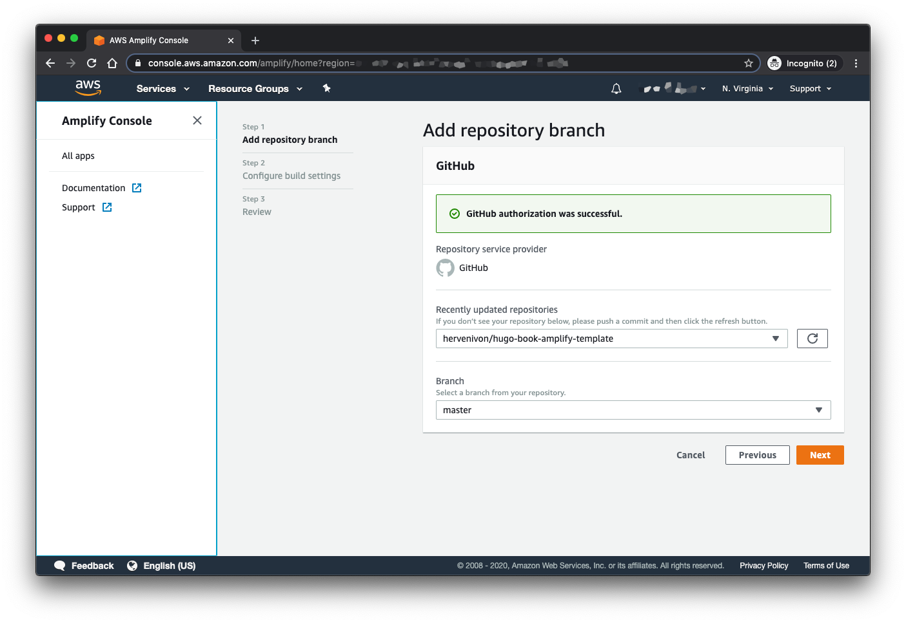
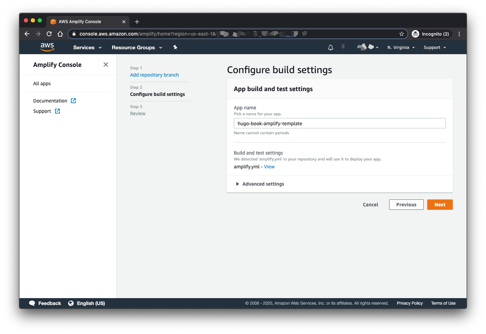
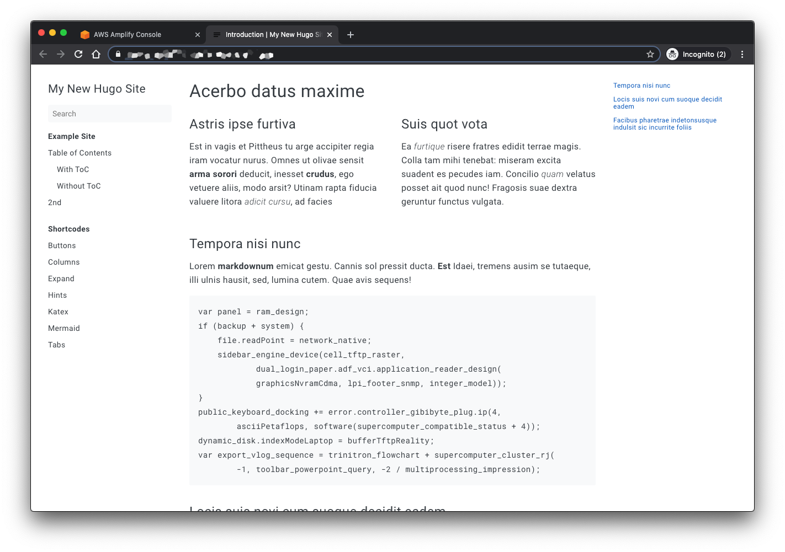
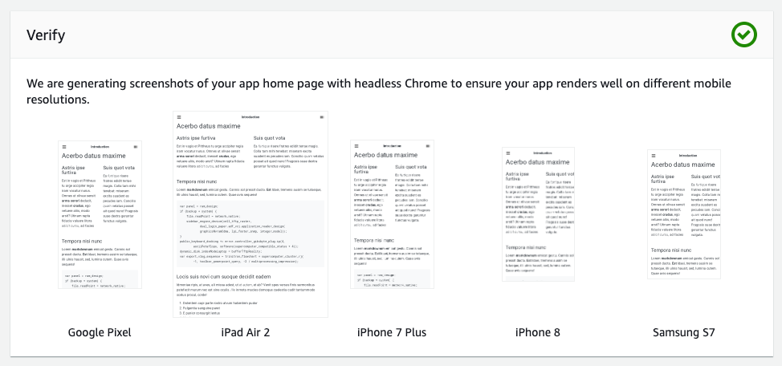

# Awesome-discoveries

This repository hosts a curated list of useful, inspiring, fascinating, and eclectic discoveries and thoughts I made and produced during my readings, experiments and job decisions making being a startup advisor and the CTO of a world leading drone company. Some topics are highly technical; some are not.

This repository uses the `hugo` static site generator along with the "Book" template. The result is hosted on AWS Amplify.

To get a hugo static site generation template working with AWS Amplify please refer to my other repository [hugo-book-amplify-template](https://github.com/hervenivon/hugo-book-amplify-template).

## 🛠 Development

Once you have configured the Amplify Console deployment process from the previous paragraph, every time you push or you do a pull request, the Amplify Console will trigger a build and deployment pipeline.

If you want to see locally what is your impact on your `markdown` content change, please execute the following in your favorite terminal (with the Hugo Pre requisites applied).

```bash
hugo server -D
```

It will compiled your static web site content, include draft in process and launch a live reloading local server serving your content.

## ⚙️ Hugo's theme configuration

Please refer to [Book configuration](https://themes.gohugo.io/hugo-book/#configuration) paragraph.

## 🏗 Deployment with the AWS Amplify Console

This repository uses the [AWS Amplify Console][amplify-console] to deploy itself as a static website. The [AWS Amplify Console][amplify-console] builds it and provision a place to store and distribute it globally. [AWS Amplify Console][amplify-console] also provides helpful capabilities to simplify both the web site lifecycle and enforce best practices.

Under the hood, the [AWS Amplify Console][amplify-console] leverages [Amazon S3 static hosting][s3-static-hosting] and [Amazon CloudFront][amazon-cloudfront] to distribute your assets. The [AWS Amplify Console][amplify-console] automatically handle cache invalidation each time you push a new version of your web site to your repository.

✅ Step by steps instructions:

1. Launch the [The AWS Amplify Console dashboard][amplify-console-dashboard]
1. Click **Get Started** under Deploy with Amplify Console
1. Select the *Repository service provider* and select **Next**
    - As this repository is on GitHub, and you have likely forked it, you'll need to select github and to authorize AWS Amplify to access your GitHub account
1. From the dropdown select the *Repository* and *Branch* of your fork

    
1. On the "Configure build settings" page leave all the defaults and select **Next**
    - AWS Amplify should have detected the `amplify.yml` settings.

    
1. On the "Review" page select **Save and deploy**

    The process takes a couple of minutes for Amplify Console to create the necessary resources and to deploy your code.

    
1. Once completed, click on the site image to open your static site in your browser.

    

If you click on the link for *Master* you'll see various pieces of information about your website deployment, including sample renderings on various platforms:



## Technical details 🛠

This repository is automatically published on [hervenivon.io](https://hervenivon.io). The next iteration is available on [next.hervenivon.io](https://hervenivon.io).

This repository is supported by `Python` scripts, here are some details that might be helpful.

### Pre-requisites

Conda must be [installed](https://conda.io/projects/conda/en/latest/user-guide/install/index.html#regular-installation).

Then create an environment dedicated to this project:

1. Create `conda` environment: `$> conda create --name ad python=3.7 ipython`
2. Activate `conda` environment: `$> conda activate ad`
3. Install other requirements: `$> pip install -r requirements.txt`

### url checker

In order to verify that referenced urls are valid please execute the following in the conda environment at the repository root directory:

```shell
./scripts/check-urls.py
```

## 🤝 Participate

If you have any suggestion, or want more details, do not hesitate to reach out!

[amazon-cloudfront]: https://aws.amazon.com/cloudfront/
[amplify-console]: https://aws.amazon.com/amplify/console/
[amplify-console-dashboard]: https://console.aws.amazon.com/amplify/home
[amplify-getting-started]: https://aws.amazon.com/amplify/console/getting-started/
[hugo-amplify-hosting]: https://gohugo.io/hosting-and-deployment/hosting-on-aws-amplify/
[hugo-quickstart]: https://gohugo.io/getting-started/quick-start/
[hugo-prerequisites]: https://gohugo.io/getting-started/installing/
[hugo-theme-book]: https://themes.gohugo.io/hugo-book/
[s3-static-hosting]: https://docs.aws.amazon.com/AmazonS3/latest/dev/WebsiteHosting.html
